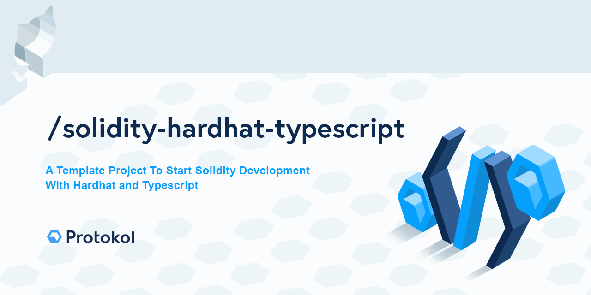

# TypeScript Solidity Boilerplate Starter Kit

A BoilerPlate Template Project To Start Solidity Development With Hardhat and Typescript. All you have to do is create a new repository from the template and start coding your smartcontracts. 

## Hardhat Configuration

- typescript support enabled
- typechain plugin installed (typescript type bindings are generated from smart contracts)/check Typechain docs
- hardhat-deploy plugin enabled (use deployments from `deploy` folder, order and tag them; multi-network)
- hardhat console enabled - to allow console.log usage within solidity code
- testing environment configured and operational

Check the Hardhat documentation for more information. 

https://hardhat.org/getting-started/

We recommend installing `hh autocomplete` so you can use `hh` shorthand globally.

`npm i -g hardhat-shorthand`

https://hardhat.org/guides/shorthand.html

## Usage

Run `npm install` and then:

- `hh compile` - to compile smart contract and generate typechain ts bindings
- `hh test` - to run tests
- `hh deploy` - to deploy to local network (see options for more)
- `hh TABTAB` - to use autocomplete
- `hh node` - to run a localhost node

Check `package.json` scripts for more options.
Use `.env.example` file and adapt it to you values and settings.

Have Fun!
