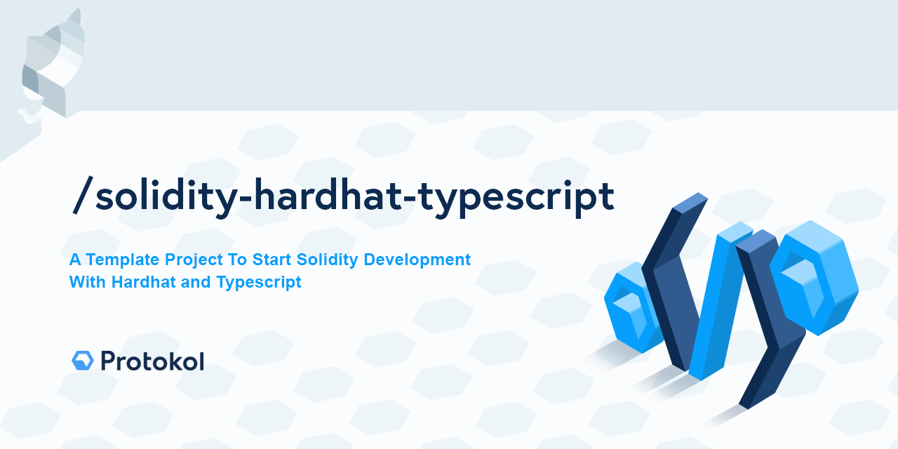

# TypeScript Solidity Boilerplate Starter Kit

A BoilerPlate Template Project To Start Solidity Development With Hardhat and Typescript.
All you have to do is create a new repository from the template and start coding your smart contracts.

## Hardhat Configuration

- [Typechain](https://github.com/dethcrypto/TypeChain) plugin enabled (typescript type bindings for smart contracts)
- [Ignition](https://hardhat.org/ignition/docs/getting-started) for contract deployment
- Testing environment configured and operational, with test coverage
- Prettier and eslint configured for project files and solidity smart contract
- [Solhint](https://github.com/protofire/solhint) configured for enforcing best practices
- Github actions workflows prepared for CI/CD
- Prepared Smart Contract Examples, Tests, Deployments and Tasks for Common ERC Standards (ERC20, ERC721, ERC1155)

Check the Hardhat documentation for more information.

https://hardhat.org/getting-started/

## Project Structure

```text
.
├── contracts
│   ├── BasicERC1155.sol
│   ├── BasicERC20.sol
│   └── BasicERC721.sol
├── ignition
│   ├── deployments
│   ├── modules
│   │   ├── BasicERC1155Module.ts
│   │   ├── BasicERC20Module.ts
│   │   └── BasicERC721Module.ts
│   └── parameters
│       └── custom.json
├── tasks
│   ├── erc1155
│   │   ├── base-uri.ts
│   │   ├── contract-uri.ts
│   │   └── mint.ts
│   ├── erc20
│   │   └── mint.ts
│   ├── erc721
│   │   ├── base-uri.ts
│   │   ├── contract-uri.ts
│   │   └── mint.ts
│   └── utils
│       ├── accounts.ts
│       ├── balance.ts
│       ├── block-number.ts
│       └── send-eth.ts
├── test
│   ├── BasicERC1155.ts
│   ├── BasicERC20.ts
│   └── BasicERC721.ts
└── hardhat.config.ts
```

## Supported Networks

- Hardhat Network (localhost)
- Ethereum Mainnet
- Ethereum Sepolia Testnet
- Polygon Mainnet
- Polygon Mumbai Testnet

Feel free to add more networks in `hardhat.config.ts` file.

## Common Hardhat Commands

- `npx hardhat compile` - to compile smart contract and generate typechain ts bindings
- `npx hardhat test` - to run tests
- `npx hardhat ignition` - to deploy smart contracts
- `npx hardhat node` - to run a localhost node
- `npx hardhat help` - to see all available commands

## Usage

### Setup

#### 1. Install Dependencies

```shell
npm install
```

#### 2. Compile Contracts

```shell
npm run compile
```

#### 3. Environment Setup

This project uses [Hardhat Keystore](https://hardhat.org/plugins/nomicfoundation-hardhat-keystore) to securely manage sensitive configuration variables like private keys and RPC URLs. Secrets are stored encrypted and never committed to disk in plain text.

**Set your private key**

```shell
npx hardhat keystore set PRIVATE_KEY
```

**Set your RPC URLs** (for the networks you plan to use)

```shell
npx hardhat keystore set SEPOLIA_RPC_URL
npx hardhat keystore set MAINNET_RPC_URL
```

**Set your Etherscan API key** (for contract verification)

```shell
npx hardhat keystore set ETHERSCAN_API_KEY
```

**List stored variables**

```shell
npx hardhat keystore list
```

### Example Flow - Deploy ERC721 Token

> This is an example flow to deploy an ERC721 token to a public network and interact with it.

#### 1.1 Deploy BasicERC721 Contract

```shell
npx hardhat ignition deploy ignition/modules/BasicERC721Module.ts --network sepolia
```

**Verify contract**

```shell
npx hardhat ignition verify chain-11155111 --network sepolia
```

#### 1.2 Deploy and Verify

```shell
npx hardhat ignition deploy ignition/modules/BasicERC721Module.ts --network sepolia --verify
```

#### 1.3 Deploy and Verify with Custom Parameters

Look at `ignition/parameters/custom.json` to see how to adjust contract parameters

```shell
npx hardhat ignition deploy ignition/modules/BasicERC721Module.ts --network sepolia --verify --parameters ignition/parameters/custom.json
```

#### 2. Interact With Contract - Mint

```shell
npx hardhat erc721-mint \
 --contract 0x3fCB912bfb67B78121C5F326C24fBb0D2ca146dD \
 --recipient 0x73faDd7E476a9Bc2dA6D1512A528366A3E50c3cF \
 --network sepolia
```

---

### Testing

#### Run Tests

```shell
npm run test
```

#### Run Coverage

```shell
npm run coverage
```

---

### Project Hygiene

#### Prettier - Non Solidity Files

```shell
npm run format:check
npm run format:write
```

#### Lint - Non Solidity Files

```shell
npm run lint:check
npm run lint:fix
```

#### Prettier - Solidity

```shell
npm run sol:format:check
npm run sol:format:write
```

#### Solhint - Enforcing styles and security best practices

```shell
npm run solhint
```

---

## Claude Code

This repo is configured for [Claude Code](https://github.com/anthropics/claude-code) with project conventions, automated agents, and skills. Claude follows the instructions in [`CLAUDE.md`](./CLAUDE.md) when working in this project.

### Getting Started

```shell
npm install -g @anthropic-ai/claude-code
claude
```

Run `claude` in the project root — it automatically reads `CLAUDE.md` for project conventions.

### Available Skills (Slash Commands)

| Command         | Description                                                                                                                                                                                         |
| --------------- | --------------------------------------------------------------------------------------------------------------------------------------------------------------------------------------------------- |
| `/new-contract` | Scaffolds a new Solidity contract with test file, Ignition module, and Hardhat tasks. Asks for contract name, token standard, and features, then generates all files following project conventions. |
| `/deploy-check` | Runs a pre-deployment checklist: compile, test, coverage, lint, format check, Ignition module review, and network config verification. Outputs a PASS/FAIL/WARN summary table.                      |

### Available Agents

- **Security Reviewer** — Comprehensive security review agent that analyzes contracts for vulnerabilities, incentive design issues, and OpenZeppelin v5 best practices. Invoke with:
    ```shell
    claude "review BasicERC20.sol for security" --agent security-reviewer
    ```

### Configured Hooks

- **Auto-format on save** — Edited `.ts` and `.sol` files are automatically formatted with Prettier after each edit.
- **Protected files** — `.env` and `package-lock.json` are blocked from direct edits.

<br>

## Contact Protokol

**Need additional help with your solidity project?**

Protokol builds custom blockchain and web3 solutions for organisations of all sizes. We build everything from smart contracts, to dApps, to fully bespoke web3 solutions.

Reach out at [protokol.com/contact](https://www.protokol.com/contact/) to learn how our web3 development services could help bring your project to life.

<br>

## Join Protokol

**Looking for an exciting new role in web3?**

Head over to [protokol.com/careers](https://www.protokol.com/careers/) to discover the roles we have available or to submit your résumé.
